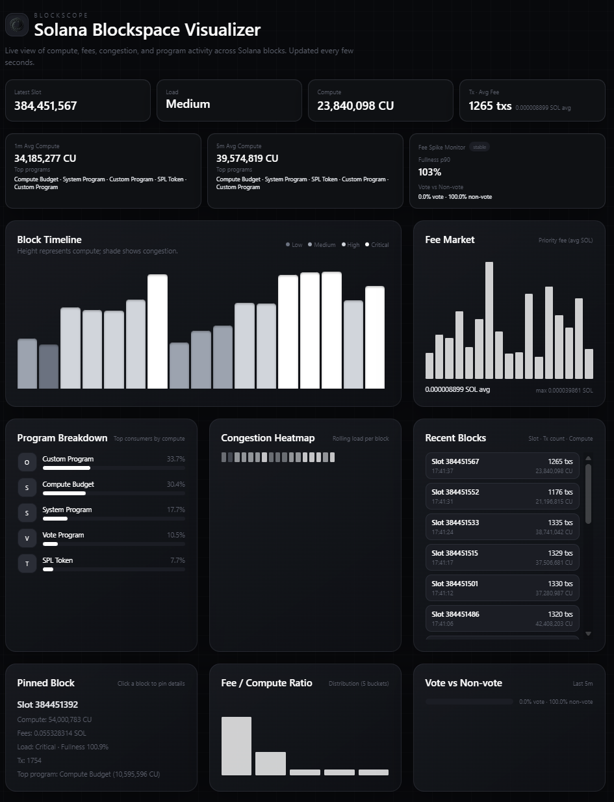

# BlockScope — Solana Blockspace Visualizer (MVP)




BlockScope is a real-time analytics dashboard that shows Solana blockspace usage: compute, fees, congestion, and top programs. The backend streams normalized block data via WebSockets and exposes REST endpoints; the frontend renders a Tailwind-powered live view. The same logo is used as the favicon (`frontend/logo.svg`).

## Quickstart (local)

```bash
# backend
cd backend
npm install
# set your RPC (public is fine but rate-limited)
echo "RPC_URL=https://api.mainnet-beta.solana.com" > .env
# run (serves frontend + API + WS)
npm start   # PORT defaults to 3000

# open in browser
open http://localhost:3000
```

If you need a different port:

```bash
PORT=4000 npm start
```

WebSocket and API paths are on the same origin: `GET /api/latest`, `GET /api/history`, WS at `/stream`.

## Project Layout

- `backend/` — Node.js + TypeScript ingestion + API + WebSocket stream. Serves the frontend statically.
- `frontend/` — Static HTML/Tailwind dashboard consuming the stream and REST API.

## Backend Configuration

Environment variables:

- `RPC_URL` — Solana RPC endpoint (with `getBlock` access)
- `RPC_URLS` — Comma-separated RPC endpoints for failover (overrides `RPC_URL`)
- `PORT` — API/WS port (default `3000`)
- `LOG_LEVEL` — pino log level (default `info`)
- `PROGRAM_MAP_PATH` — optional path to a JSON program map (defaults to `backend/src/programs.json`)
- `PERSIST_HISTORY` — set `true` to enable SQLite persistence
- `DB_PATH` — optional SQLite path (default `blockscope.db` in cwd)

Endpoints:

- `GET /api/latest` — latest block summary (includes rolling stats)
- `GET /api/history?count=100` — last N blocks (capped 600)
- `GET /api/aggregates/top-programs?hours=24&limit=10`
- `GET /api/aggregates/fullness-hourly?hours=24`
- `GET /api/aggregates/fee-vs-compute?hours=24`
- `WS /stream` — snapshot replay plus per-block events
- `/health` — simple health indicator
- `/` — serves the frontend

Rate limits: public RPCs may return 429; the backend backs off, slows polling (~2s), and rotates through `RPC_URLS` when provided. For stability, use a private RPC URL.

## Frontend Notes

- Served by the backend on the same origin.
- WebSocket URL auto-derives from `window.location` (`wss://host/stream`).
- No build step required; Tailwind via CDN.

## Persistence (optional)

Enable SQLite storage with `PERSIST_HISTORY=true` to retain blocks/program compute for aggregate queries. Default DB path is `blockscope.db` (override via `DB_PATH`).

## Milestones (MVP)

1. Core ingestion + normalization (compute, programs, fees)
2. Backend services (fee/congestion metrics, REST, WebSocket)
3. Frontend visuals (timeline, fee trend, program breakdown, heatmap)
4. Polish (auto-reconnect, bounded history, docs)
